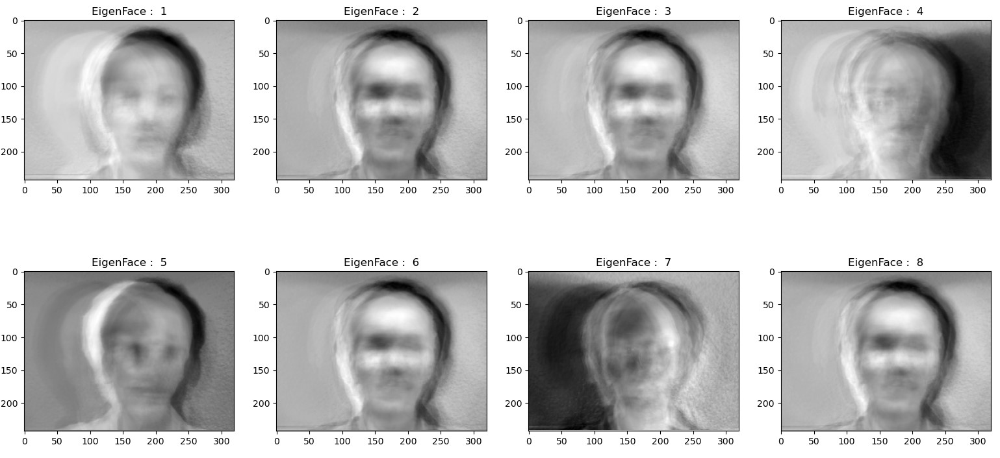

# Eigen Faces
Demonstrate generating eigen faces for a chosen image dataset.

Dataset: [Yale Face Database](http://vision.ucsd.edu/content/yale-face-database). It contains 165 grayscale images in GIF format of 15 individuals. There are 11 images per subject, one per different facial expression or configuration (sleepy, surprised, wink, etc).

Each image in the dataset is flattened and treated as a vector in the high-dimensional vector space of face images. Using PCA (Principle Component Analysis), we choose the top-k faces to form a basis set of all the images.
This leads to dimensionality reduction by allowing smaller set of basis images to represent all the images in the dataset.

The covariance matrix of the mean subtracted images is computed, and the corresponding Eigen vectors and Eigen values are found. These eigen vectors are called as Eigen Faces. 
They are of the same dimension as the flattened image vectors. Eigen vectors correspond to the directions in which the image is skewed from the mean of all images.

Top 8 Eigen Faces are shown below: 

